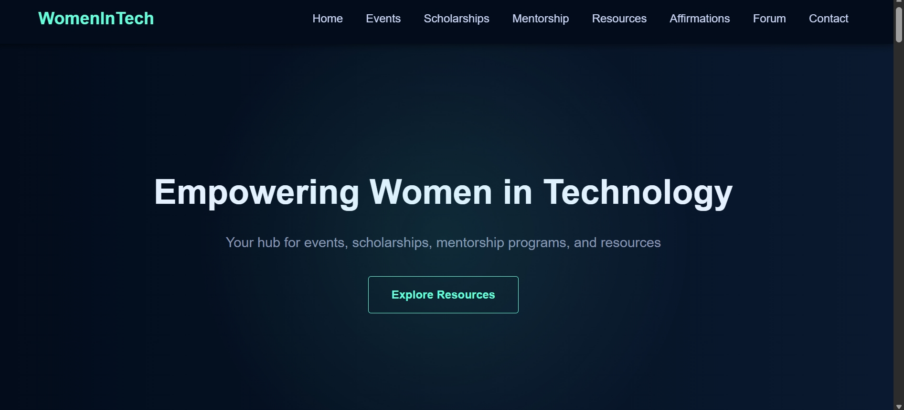

# WomenTechmakers Resource Hub

A responsive web application built for the WomenTechmakers college club to share technical opportunities, events, and learning resources.
This project was developed as part of a co-lead selection task.

##  Purpose
The goal of this website is to provide a centralized resource hub for women interested in technology,
helping them discover events, programs, and growth opportunities.

##  Features
- Responsive and clean UI using HTML & CSS
- Interactive elements using JavaScrip
- Daily Affirmations - Interactive positive affirmation generator for motivation
- Events Calendar - Discover upcoming conferences, workshops, and networking events
- Scholarship Database - Find financial support opportunities specifically for women in tech
- Resource Library - Access curated articles, guides, and learning materials
- Community Forum - Safe space for discussions and connections

##  Tech Stack
- HTML
- CSS
- JavaScript

## 📸 Preview

##  How to Run
1. Clone the repository
2. Open `index.html` in your browser

##  Author
Sneha Tiwari  
GitHub: https://github.com/ssnehatiwari21
